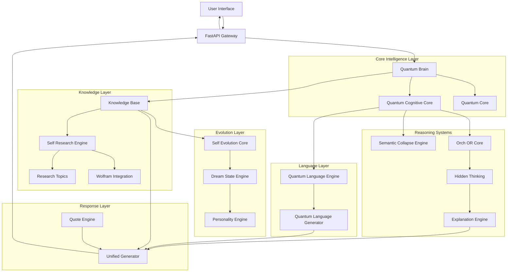
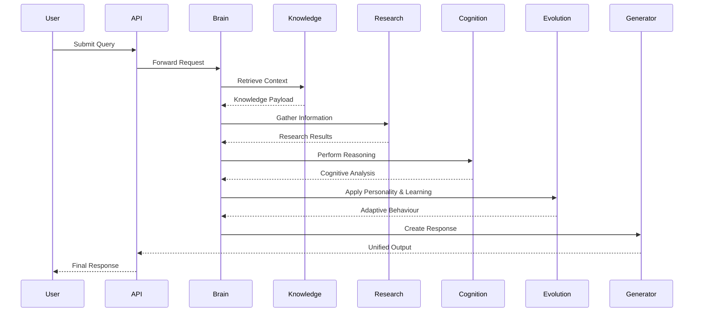
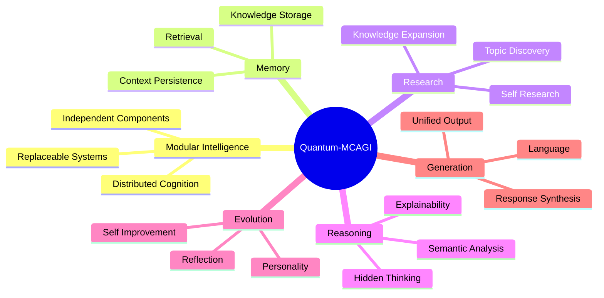

<br>

<div align="center">

# ⚛️ Quantum-MCAGI

### Modular Cognitive Artificial General Intelligence

###### *Exploring Self-Evolving Intelligence Through Cognitive Architecture, Autonomous Research,                                          Knowledge Systems, and Quantum-Inspired Computation*

<br>


</div>

<div align="center">
  
---
  
### 🧠 Think • Learn • Research • Evolve • Explain

#-architecture •
#-features •
#-installation •
#-core-components •
#-roadmap •
#-contributing
 
</div>


### Quantum-MCAGI is an experimental research platform exploring the next generation of cognitive AI systems through a modular, self-evolving architecture.

Rather than treating intelligence as a single model, Quantum-MCAGI investigates how specialised cognitive components can collaborate to produce reasoning, memory, research, adaptation, and explainability. The project combines quantum-inspired concepts, autonomous knowledge discovery, semantic reasoning mechanisms, and adaptive learning systems into a unified cognitive framework.

The architecture is designed around the principle that intelligence emerges from the interaction of multiple cognitive processes, including knowledge retrieval, research, reflection, personality modelling, reasoning, and response synthesis. Each subsystem operates as an independent component while contributing to a broader orchestration layer that coordinates decision making and behavioural adaptation.

Quantum-MCAGI serves as a research environment for experimenting with:

- Artificial General Intelligence (AGI) architectures
- Cognitive reasoning systems
- Autonomous research agents
- Self-evolving intelligence models
- Explainable AI techniques
- Knowledge representation and memory systems
- Human-AI collaboration
- Quantum-inspired computational frameworks

The project prioritises modularity, transparency, and experimentation, making it easier to study how complex intelligence might emerge from interconnected cognitive systems rather than a monolithic approach.

While Quantum-MCAGI is not an AGI system, it represents an exploration into the architectural foundations that may contribute to future advances in machine cognition.
# 🎯 Vision

Most AI systems focus on prediction.

Quantum-MCAGI explores cognition.

The project investigates an architecture where intelligence emerges from collaboration between:

- Memory
- Reasoning
- Research
- Reflection
- Self-modification
- Explainability

Rather than one model performing everything, specialised cognitive components exchange information through a structured orchestration layer.

---

# 🏛 Architecture

## High-Level System Architecture



---

## Cognitive Processing Flow



---

## Design Philosophy



---

# 🚀 Features

## Quantum Cognitive Processing

A central cognitive layer coordinating thought formation, semantic processing, and decision synthesis.

### Capabilities

- Context integration
- Intent understanding
- Multi-system orchestration
- Cognitive routing

---

## Autonomous Research

Dedicated research engines enable knowledge exploration beyond static memory.

### Capabilities

- Topic expansion
- Research planning
- Knowledge acquisition
- Information synthesis

---

## Knowledge Systems

Structured memory architecture supporting persistent knowledge representation.

### Capabilities

- Context retrieval
- Long-term memory concepts
- Knowledge enrichment
- Information management

---

## Self-Evolution Framework

Experimental infrastructure designed to investigate adaptive behaviour.

### Capabilities

- Reflection loops
- Behaviour refinement
- Learning strategies
- Self-assessment

---

## Personality System

Cognitive identity layer that helps maintain behavioural consistency.

### Capabilities

- Personality modelling
- Consistent responses
- Preference representation
- Adaptive communication

---

## Dream State Processing

An experimental subsystem inspired by memory consolidation concepts.

### Capabilities

- Reflection cycles
- Concept integration
- Pattern emergence
- Cognitive simulation

---

## Explainable Intelligence

Improves transparency through reasoning reconstruction.

### Capabilities

- Decision explanations
- Reasoning trace support
- Human-readable insights
- Cognitive interpretability

---

# 🧩 Core Components

```text
backend/

├── quantum_cognitive_core.py
├── quantum_core.py
├── quantum_brain.py
├── server.py
├── chat.py
│
├── self_evolution_core.py
├── dream_state.py
├── personality_engine.py
│
├── semantic_collapse_engine.py
├── hidden_thinking.py
├── explanation_engine.py
├── orch_or_core.py
│
├── knowledge_base.py
├── self_research.py
├── research_topics.py
├── wolfram_integration.py
│
├── quantum_language_engine.py
├── quantum_language_generator.py
├── unified_generator.py
├── quote_engine.py
│
├── routes_chat.py
├── routes_brain.py
├── routes_cognitive.py
├── routes_explorer.py
│
└── text_analyzer.py
```

---

# ⚙️ Installation

## Clone Repository

```bash
git clone https://github.com/strdst7/Quantum-MCAGI.git

cd Quantum-MCAGI
```

---

## Create Virtual Environment

### Linux / macOS

```bash
python3 -m venv .venv

source .venv/bin/activate
```

### Windows

```powershell
python -m venv .venv

.venv\Scripts\activate
```

---

## Install Dependencies

```bash
pip install -r requirements.txt
```

---

## Run Application

```bash
bash start.sh
```

or

```bash
python backend/server.py
```

---

# 📡 API Structure

```text
/api

├── /chat
├── /brain
├── /cognitive
├── /explorer
└── /research
```

---

# 🔬 Research Domains

Quantum-MCAGI is designed as a laboratory for experimentation across:

- Artificial General Intelligence
- Cognitive Architectures
- Autonomous Agents
- Explainable AI
- Memory Systems
- Self-Evolving Systems
- Semantic Reasoning
- Human-AI Interaction
- Computational Cognition
- Quantum-Inspired Information Processing

---

# 📚 Development Principles

## 1. Modularity

Every subsystem should be independently replaceable.

## 2. Transparency

Reasoning should be explainable whenever possible.

## 3. Expandability

New cognitive modules should integrate with minimal friction.

## 4. Adaptability

Learning and evolution mechanisms should support future experimentation.

## 5. Research First

The project prioritises exploration over production optimisation.

---

# 🗺 Roadmap

## Intelligence

- [ ] Long-term memory systems
- [ ] Cognitive state persistence
- [ ] Enhanced reasoning graphs
- [ ] Multi-stage planning

## Research

- [ ] Autonomous topic discovery
- [ ] Research feedback loops
- [ ] Knowledge graph integration

## Cognition

- [ ] Multi-agent cognition
- [ ] Dynamic self-reflection
- [ ] Adaptive belief systems

## Infrastructure

- [ ] Distributed architecture
- [ ] Plugin ecosystem
- [ ] Monitoring dashboard
- [ ] Benchmark suite

---

# 📊 System Goals

| Domain | Objective |
|----------|------------|
| Memory | Persistent contextual understanding |
| Research | Autonomous knowledge expansion |
| Reasoning | Multi-layer semantic processing |
| Evolution | Adaptive behavioural improvement |
| Explainability | Human-readable reasoning |
| Language | Unified response generation |

---

# 🤝 Contributing

Contributions are welcome from researchers, engineers, and enthusiasts interested in:

- AGI Research
- AI Engineering
- Cognitive Science
- Autonomous Agents
- Explainable AI
- Systems Design
- Knowledge Representation
- Machine Learning Infrastructure

### Development Workflow

```bash
git checkout -b feature/my-feature

git commit -m "Add feature"

git push origin feature/my-feature
```

Open a Pull Request describing:

- Problem addressed
- Design decisions
- Testing performed
- Future considerations

---

# ⚠️ Disclaimer

Quantum-MCAGI is an experimental research project.

The concepts explored within this repository should not be interpreted as evidence of achieved Artificial General Intelligence (AGI).

Many modules investigate theoretical and architectural approaches to intelligence, cognition, reasoning, and adaptation.

---

# 📖 Citation

If you use Quantum-MCAGI in research, publications, or derivative work, please reference the project repository.

```bibtex
@software{quantum_mcagi,
  title={Quantum-MCAGI},
  author={strdst7},
  year={2026},
  url={https://github.com/strdst7/Quantum-MCAGI}
}
```

---

# 🌌 Closing Thought

> Intelligence is not a single algorithm.
>
> It is the emergence of memory, reasoning, learning, reflection, and adaptation working together as one evolving system.


<div align="center">

#### ⚛️ Quantum-MCAGI

**Think • Learn • Research • Evolve • Explain**

#### Built by **aimirah** · **MI4 Inc.**

</div>
